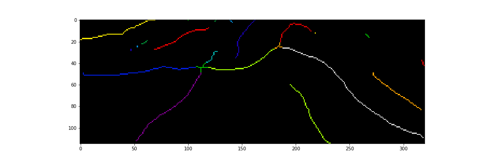

# AutoCracks
## Information
- [Competition page](https://community.topcoder.com/longcontest/?module=ViewProblemStatement&rd=17037&pm=14753)
- [Final leaderboard](https://community.topcoder.com/longcontest/stats/?module=ViewOverview&rd=17037)
- My Topcoder handle: [amorgun](https://www.topcoder.com/members/amorgun/)

## Solution
### 1. Independent processing for each z-level.
1) Extract skeleton using `skimage.morphology.skeletonize function`.

2) Find joints between cracks as pixels with 3 or more neighbors.

3) Build a graph of cracks connected by joints.

4) Merge cracks adjacent to each joint by a greedy algorithm. We repeatedly find a pair of cracks with the biggest angle until there are no more cracks that we can join

5) Assign a label to each pixel from the initial images as the label of the nearest non-joint point of the skeleton.

### 2. Merging results for all z-levels.
After the previous step each layer has its own independent set of crack labels. I describe a procedure of merging labels for two layers and then we apply this procedure sequentially to all layers.  
Clearly background pixels are always labeled as 0 and their labels do not need to be merged.  
I will operate with two layers: the previous and the current one. I assume that the previous layer already has the final labels and we need to assign this labels to the current layer. We will process each labeled area from the current layer separately.  
I considered 3 possible options:
1) A high percentage (let’s say 90%) of points with the new label had the same label on the previous layer. In this case I mark all pixels with this label on the current layer by the label from the previous layer.
2) Most of the points (let’s say 50%) in the area had some label at the previous layer but there is no clear majority. In this case I assigned labels to a pixel from the area as a label of the closest labeled pixel on the previous layer.
3) Otherwise we need to create new unique clack label that was not used in the previous layer and assign this label to all pixels from the area. 
    
### 3. Additional tricks.
1) Described earlier procedure of merging layers is prone to the bad labeling of the first layer so I used averaged first 50 layers as the initial layer.
2) `skimage.morphology.skeletonize` yields weird curves near joints so it’s better to ignore some area around joints for calculating crack direction vectors.
